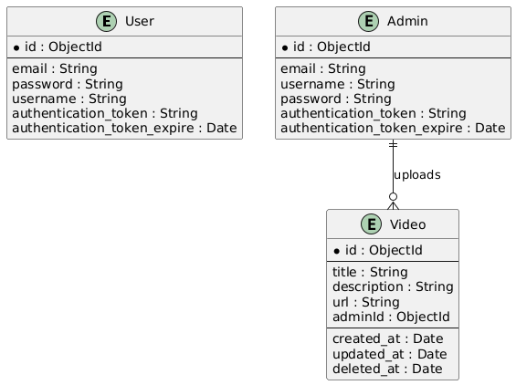

# Video Platform
A comprehensive platform for managing and viewing video content. This project provides features like video upload, playback, categorization, and sharing.

## Table of Contents
- [Features](#features)
- [Installation](#installation)
  - [Prerequisites](#prerequisites)
  - [Backend (Java Spring Boot)](#backend-java-spring-boot)
  - [Frontend](#frontend)
- [Usage](#usage)
- [API Documentation](#api-documentation)
  - [Admin Routes](#admin-routes)
  - [User Routes](#user-routes)
- [Contributing](#contributing)
- [License](#license)
- [ER Diagram](#er-diagram)
- [Additional Resources](#additional-resources)

## Features

- Upload and manage video content
- Next and previous video navigation
- Search functionality to find videos easily
- Share video links
- User authentication and authorization (if applicable)

## Installation

### Prerequisites

- Node.js
- npm or yarn
- Git
- Java JDK 11 or later
- Maven

### Backend (Java Spring Boot)

1. Clone the repository:

    ```bash
    git clone https://github.com/mystqueen/Video-Platform.git
    cd Video-Platform/backend
    ```

2. Install the dependencies and build the project:

    ```bash
    mvn clean install
    ```

3. Set up the environment variables:

    Create an `application.properties` file in the `src/main/resources` directory and add the necessary environment variables. Example:

    ```properties
    spring.datasource.url=jdbc:mysql://localhost:8080/your_database
    spring.datasource.username=your_username
    spring.datasource.password=your_password
    spring.jpa.hibernate.ddl-auto=update
    jwt.secret=your_jwt_secret
    ```

4. Run the server:

    ```bash
    mvn spring-boot:run
    ```

### Frontend

1. Navigate to the `frontend` repository:

    ```bash
    git clone https://github.com/mystqueen/videoPlatform-frontend.git
    cd videoPlatform-frontend
    ```

2. Install the dependencies:

    ```bash
    npm install
    ```

3. Run the development server:

    ```bash
    npm start
    ```

## Usage

1. Open your browser and navigate to `http://localhost:3000` for the frontend.
2. The backend API should be running on `http://localhost:8080` (or the port specified in your application properties).

## API Documentation

### Admin Routes

#### 1. Register

Register a new admin user.

- **URL**: `/admin/register`
- **Method**: `POST`
- **Headers**:
  ```json
  {
    "Content-Type": "application/json"
  }
  ```
- **Request Body**:
  ```json
  {
    "username": "admin",
    "password": "securepassword"
  }
  ```
- **Responses**:
    - `201 Created`: Admin registered successfully.
    - `400 Bad Request`: Missing or invalid parameters.
    - `500 Internal Server Error`: Server encountered an error.

**Example Request**:
```javascript
fetch('https://video-platform-backend.com/admin/register', {
  method: 'POST',
  headers: {
    'Content-Type': 'application/json'
  },
  body: JSON.stringify({
    username: 'admin',
    password: 'securepassword'
  })
})
.then(response => response.json())
.then(data => console.log(data))
.catch(error => console.error('Error:', error));
```

**Example Response**:
```json
{
  "message": "Admin registered successfully."
}
```

#### 2. Login

Authenticate an admin user.

- **URL**: `/admin/login`
- **Method**: `POST`
- **Headers**:
  ```json
  {
    "Content-Type": "application/json"
  }
  ```
- **Request Body**:
  ```json
  {
    "username": "admin",
    "password": "securepassword"
  }
  ```
- **Responses**:
    - `200 OK`: Authentication successful.
    - `401 Unauthorized`: Invalid username or password.
    - `500 Internal Server Error`: Server encountered an error.

**Example Request**:
```javascript
fetch('https://video-platform-backend.com/admin/login', {
  method: 'POST',
  headers: {
    'Content-Type': 'application/json'
  },
  body: JSON.stringify({
    username: 'admin',
    password: 'securepassword'
  })
})
.then(response => response.json())
.then(data => console.log(data))
.catch(error => console.error('Error:', error));
```

**Example Response**:
```json
{
  "data": {
    "fullname": "Admin User",
    "email": "admin@example.com",
    "emailVerified": true,
    "authentication": {
      "session": {
        "token": "admin123",
        "expires": "2024-07-06T12:00:00Z"
      },
      "otp": {
        "code": "123456",
        "expires": "2024-07-06T12:00:00Z"
      },
      "password": "securepassword"
    }
  }
}
```

#### 3. File Upload to Azure

Upload a video file to Azure Blob Storage.

- **URL**: `/admin/file/upload`
- **Method**: `POST`
- **Headers**:
  ```json
  {
    "Content-Type": "multipart/form-data"
  }
  ```
- **Request Parameters**:
  ```json
  {
    "file": "The file to be uploaded."
  }
  ```
- **Responses**:
    - `200 OK`: File uploaded successfully.
    - `400 Bad Request`: Missing file parameter.
    - `500 Internal Server Error`: Server encountered an error.

**Example Request**:
```javascript
const formData = new FormData();
formData.append('file', fileInput.files[0]);

fetch('https://video-platform-backend.com/admin/file/upload', {
  method: 'POST',
  body: formData
})
.then(response => response.json())
.then(data => console.log(data))
.catch(error => console.error('Error:', error));
```

**Example Response**:
```json
{
  "data": {
    "id": "video123",
    "name": "example.mp4",
    "url": "https://yourstorageaccount.blob.core.windows.net/yourcontainer/example.mp4",
    "created_at": "2024-07-06T12:00:00Z"
  }
}
```

#### 4. Delete Video

Delete a video from Azure Blob Storage.

- **URL**: `/admin/file/delete/:fileId`
- **Method**: `DELETE`
- **Path Parameters**:
  ```json
  {
    "fileId": "The ID of the video to delete."
  }
  ```
- **Responses**:
    - `200 OK`: Video deleted successfully.
    - `404 Not Found`: Video not found.
    - `500 Internal Server Error`: Server encountered an error.

**Example Request**:
```javascript
fetch('https://video-platform-backend.com/admin/file/delete/video123', {
  method: 'DELETE',
  headers: {
    'Authorization': 'Bearer SESSION_TOKEN'
  }
})
.then(response => response.json())
.then(data => console.log(data))
.catch(error => console.error('Error:', error));
```

**Example Response**:
```json
{
  "message": "Video deleted successfully."
}
```

#### 5. List All Videos

List all videos available on the server.

- **URL**: `/admin/files`
- **Method**: `GET`
- **Headers**:
  ```json
  {
    "Authorization": "Bearer SESSION_TOKEN"
  }
  ```
- **Responses**:
    - `200 OK`: Videos listed successfully.
    - `500 Internal Server Error`: Server encountered an error.

**Example Request**:
```javascript
fetch('https://video-platform-backend.com/admin/files', {
  method: 'GET',
  headers: {
    'Authorization': 'Bearer SESSION_TOKEN'
  }
})
.then(response => response.json())
.then(data => console.log(data))
.catch(error => console.error('Error:', error));
```

**Example Response**:
```json
{
  "data": [
    {
      "id": "video123",
      "name": "example.mp4",
      "url": "https://yourstorageaccount.blob.core.windows.net/yourcontainer/example.mp4",
      "created_at": "2024-07-06T12:00:00Z"
    },
    {
      "id": "video124",
      "name": "example2.mp4",
      "url": "https://yourstorageaccount.blob.core.windows.net/yourcontainer/example2.mp4",
      "created_at": "2024-07-06T12:00:00Z"
    }
  ]
}
```

### User Routes

#### 1. Register

Register a new user.

- **URL**: `/user/register`
- **Method**: `POST`
- **Headers**:
  ```json
  {
    "Content-Type": "application/json"
  }
  ```
- **Request Body**:
  ```json
  {
    "username": "user",
    "password": "securepassword"
  }
  ```
- **Responses**:
    - `201 Created`: User registered successfully.
    - `400 Bad Request`: Missing or invalid parameters.
    - `500 Internal Server Error`: Server encountered an error.

**Example Request**:
```javascript
fetch('https://video-platform-backend.com/user/register', {
  method

: 'POST',
  headers: {
    'Content-Type': 'application/json'
  },
  body: JSON.stringify({
    username: 'user',
    password: 'securepassword'
  })
})
.then(response => response.json())
.then(data => console.log(data))
.catch(error => console.error('Error:', error));
```

**Example Response**:
```json
{
  "message": "User registered successfully."
}
```

#### 2. Login

Authenticate a user.

- **URL**: `/user/login`
- **Method**: `POST`
- **Headers**:
  ```json
  {
    "Content-Type": "application/json"
  }
  ```
- **Request Body**:
  ```json
  {
    "username": "user",
    "password": "securepassword"
  }
  ```
- **Responses**:
    - `200 OK`: Authentication successful.
    - `401 Unauthorized`: Invalid username or password.
    - `500 Internal Server Error`: Server encountered an error.

**Example Request**:
```javascript
fetch('https://video-platform-backend.com/user/login', {
  method: 'POST',
  headers: {
    'Content-Type': 'application/json'
  },
  body: JSON.stringify({
    username: 'user',
    password: 'securepassword'
  })
})
.then(response => response.json())
.then(data => console.log(data))
.catch(error => console.error('Error:', error));
```

**Example Response**:
```json
{
  "data": {
    "fullname": "User",
    "email": "user@example.com",
    "emailVerified": true,
    "authentication": {
      "session": {
        "token": "user123",
        "expires": "2024-07-06T12:00:00Z"
      },
      "otp": {
        "code": "123456",
        "expires": "2024-07-06T12:00:00Z"
      },
      "password": "securepassword"
    }
  }
}
```

#### 3. Reset Password

Request a password reset.

- **URL**: `/user/reset-password`
- **Method**: `POST`
- **Headers**:
  ```json
  {
    "Content-Type": "application/json"
  }
  ```
- **Request Body**:
  ```json
  {
    "email": "user@example.com"
  }
  ```
- **Responses**:
    - `200 OK`: Password reset request processed successfully.
    - `400 Bad Request`: Missing or invalid parameters.
    - `500 Internal Server Error`: Server encountered an error.

**Example Request**:
```javascript
fetch('https://video-platform-backend.com/user/reset-password', {
  method: 'POST',
  headers: {
    'Content-Type': 'application/json'
  },
  body: JSON.stringify({
    email: 'user@example.com'
  })
})
.then(response => response.json())
.then(data => console.log(data))
.catch(error => console.error('Error:', error));
```

**Example Response**:
```json
{
  "message": "Password reset request processed successfully."
}
```

#### 4. Download Video

Download a video file.

- **URL**: `/user/download/:fileId`
- **Method**: `GET`
- **Path Parameters**:
  ```json
  {
    "fileId": "The ID of the video to download."
  }
  ```
- **Responses**:
    - `200 OK`: Video downloaded successfully.
    - `404 Not Found`: Video not found.
    - `500 Internal Server Error`: Server encountered an error.

**Example Request**:
```javascript
fetch('https://video-platform-backend.com/user/download/video123', {
  method: 'GET',
  headers: {
    'Authorization': 'Bearer SESSION_TOKEN'
  }
})
.then(response => response.blob())
.then(blob => {
  const url = window.URL.createObjectURL(blob);
  const a = document.createElement('a');
  a.style.display = 'none';
  a.href = url;
  a.download = 'video123.mp4';
  document.body.appendChild(a);
  a.click();
  window.URL.revokeObjectURL(url);
})
.catch(error => console.error('Error:', error));
```

**Example Response**:
```json
{
  "message": "Video downloaded successfully."
}
```

## Contributing

Contributions are welcome! Please follow these steps:

1. Fork the repository.
2. Create a new branch for your feature or bugfix.
3. Commit your changes.
4. Push to your branch.
5. Create a pull request.

Please ensure your code follows the project's coding standards and includes tests for new functionality.

## License

This project is licensed under the MIT License - see the [LICENSE](LICENSE) file for details.

## ER Diagram

Below is the ER diagram for the Video Platform application:




## Additional Resources

- [MongoDB](https://www.mongodb.com/)
- [Node.js](https://nodejs.org/)
- [Express](https://expressjs.com/)
- [Mongoose](https://mongoosejs.com/)
- [Spring Boot](https://spring.io/projects/spring-boot)
- [React](https://reactjs.org/)
```


